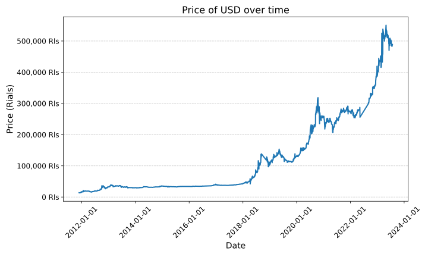

# TGJU-API
TGJU-API is a Python web scraper for retrieving currency and gold prices from the tgju.org website. It uses the BeautifulSoup and js2xml libraries to parse the HTML and JavaScript on the website.

# Installation

## Dependencies

Before using TGJU-API, make sure you have the following dependencies installed:
- BeautifulSoup
- js2xml

You can install the dependencies using pip:
```
pip install beautifulsoup4 js2xml
```

Clone the repository and import the package:

```
git clone https://github.com/amirh0ss3in/tgju_api.git
cd tgju_api
python exammple.py
```

## Usage
Here's an example of how to use TGJU_API to retrieve currency data for the US dollar:
```
from tgju_api import CurrencyScraper
import matplotlib.dates as mdates
import matplotlib.pyplot as plt

scraper = CurrencyScraper()
currencies = scraper.currencies_dict
print(currencies)

usd_data = scraper.scrape_currency('USD', unix_timestamp=False)
print(usd_data.head())

fig, ax = plt.subplots(figsize=(10, 6))
ax.plot(usd_data['timestamp'], usd_data['price'], color='#1f77b4', linewidth=2)
ax.set_xlabel('Date', fontsize=14)
ax.xaxis.set_major_formatter(mdates.DateFormatter('%Y-%m-%d'))
ax.tick_params(axis='x', labelsize=12, rotation=45)
ax.set_ylabel('Price (Rials)', fontsize=14)
ax.yaxis.set_major_formatter('{x:,.0f} Rls')
ax.tick_params(axis='y', labelsize=12)
ax.set_title('Price of USD over time', fontsize=16)
ax.grid(axis='y', linestyle='--', alpha=0.7)
plt.tight_layout()
plt.savefig('USD.svg')
plt.show()
```

This code snippet will display a list of all available currencies:
```
['USD', 'EUR', 'AED', 'GBP', 'TRY', 'CHF', 'JPY', 'CAD', 'AUD', 'NZD', 'SGD', 'INR', 'PKR', 'IQD', 'SYP', 'AFN', 'DKK', 'SEK', 'NOK', 'SAR', 'QAR', 'OMR', 'KWD', 'BHD', 'MYR', 'THB', 'HKD', 'RUB', 'AZN', 'AMD', 'GEL', 'KGS', 'TJS', 'TMT', 'gold_24k', 'gold_18k', 'mesghal']
```
And the initial few rows of historical data for the US dollar:
```
price  timestamp
0  13700 2011-11-26
1  13440 2011-11-27
2  13350 2011-11-28
3  13400 2011-11-29
4  13500 2011-11-30
```
And finally, plots the price over time:


